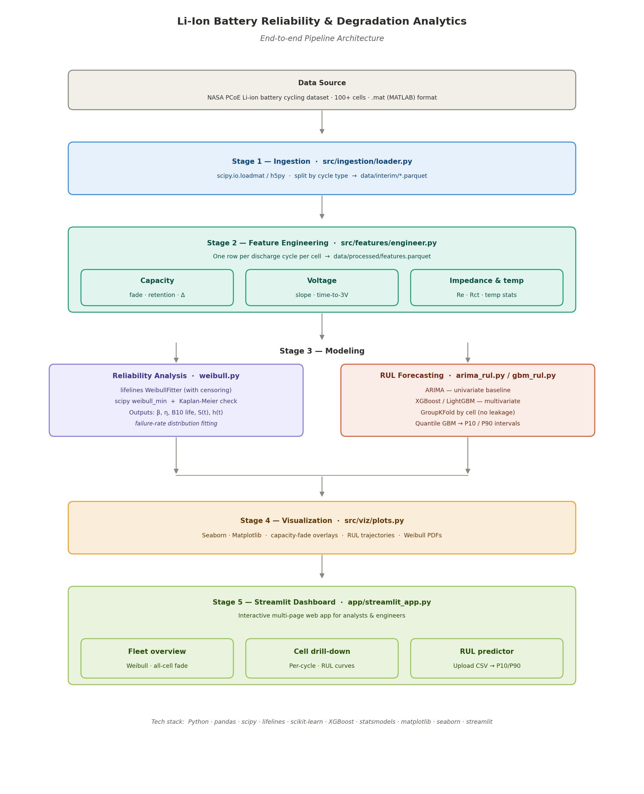

# Li-Ion Battery Reliability & Degradation Analytics

> End-to-end pipeline for extracting, modeling, and forecasting lithium-ion battery degradation using the NASA PCoE Li-ion battery cycling dataset — from raw `.mat` files to an interactive Streamlit dashboard.

Built with **Python**, **SciPy**, **lifelines**, **scikit-learn**, **XGBoost**, **Pandas**, **Seaborn**, **Matplotlib**, and **Streamlit**.

---

## Architecture



The pipeline runs in five stages — raw `.mat` files are ingested and transformed into engineered degradation features, modeled through two parallel tracks — Weibull reliability analysis and RUL forecasting — and surfaced through an interactive Streamlit dashboard.

---

## Overview

Lithium-ion batteries degrade with every charge and discharge cycle. Accurately predicting when a battery will fail — and how many useful cycles remain — is critical for electric vehicles, consumer electronics, grid storage, and aerospace systems.

This project builds a complete battery prognostics pipeline that:

- Ingests raw NASA PCoE battery cycling data across multiple cells
- Engineers per-cycle degradation features — capacity fade, voltage-curve behavior, impedance growth, and thermal response
- Fits Weibull reliability models to quantify failure-rate distributions
- Forecasts Remaining Useful Life — RUL — using ARIMA and gradient-boosted models
- Presents reliability and forecasting insights through a multi-page Streamlit dashboard

---

## Dataset

**Source:** [NASA Prognostics Center of Excellence — Battery Data Set](https://www.nasa.gov/intelligent-systems-division/discovery-and-systems-health/pcoe/pcoe-data-set-repository/)

The dataset contains 18650 lithium-ion cells cycled under controlled laboratory conditions at 24 °C. Cells were charged using constant-current charging — 1.5 A to 4.2 V — and discharged at 2 A until cutoff voltages between 2.2 V and 2.7 V.

Each `.mat` file contains nested cycle-level measurements, including:

- Voltage
- Current
- Temperature
- Capacity
- Impedance
- Charge, discharge, and impedance test cycles

**End-of-life definition:** A cell is considered failed when capacity drops to **≤ 70% of rated capacity** — approximately **1.4 Ah** from a rated **2.0 Ah** cell.

Dataset files are not committed to this repository. Download the files manually and place them in `data/raw/`:

```text
data/raw/
├── B0005.mat
├── B0006.mat
└── ...
```

---

## Project Structure

```text
li-ion-battery-analytics/
├── data/
│   ├── raw/                          NASA .mat files — not tracked
│   ├── interim/                      Parsed per-cell parquet files
│   └── processed/                    Feature-engineered modeling dataset
├── docs/
│   └── architecture.png              Pipeline diagram
├── notebooks/
│   ├── 01_eda.ipynb
│   ├── 02_feature_engineering.ipynb
│   ├── 03_weibull_reliability.ipynb
│   └── 04_rul_forecasting.ipynb
├── src/
│   ├── ingestion/
│   │   └── loader.py                 Parse .mat files into structured outputs
│   ├── features/
│   │   └── engineer.py               Build per-cycle degradation features
│   ├── models/
│   │   ├── weibull.py                Weibull reliability fitting and B-life metrics
│   │   ├── arima_rul.py              ARIMA-based RUL forecasting
│   │   └── gbm_rul.py                Gradient-boosted RUL regression
│   └── viz/
│       └── plots.py                  Reusable visualization helpers
├── app/
│   └── streamlit_app.py              Multi-page interactive dashboard
├── tests/
├── requirements.txt
└── README.md
```

---

## Quickstart

```bash
# 1. Clone the repository and install dependencies
git clone https://github.com/<your-username>/li-ion-battery-analytics.git
cd li-ion-battery-analytics

python -m venv venv
source venv/bin/activate

pip install -r requirements.txt

# 2. Download the NASA battery dataset
# Place all .mat files inside data/raw/

# 3. Run the full pipeline
python -m src.ingestion.loader
python -m src.features.engineer
python -m src.models.weibull
python -m src.models.gbm_rul

# 4. Launch the dashboard
streamlit run app/streamlit_app.py
```

---

## Pipeline Stages

### Stage 1 — Data Ingestion

The ingestion module parses nested MATLAB battery files using `scipy.io.loadmat` — with optional `h5py` support for MATLAB v7.3 files.

It separates cycles by type:

- Charge cycles
- Discharge cycles
- Impedance cycles

Each battery cell is converted into a clean, structured parquet file and saved to `data/interim/`.

---

### Stage 2 — Feature Engineering

The feature engineering stage builds one row per discharge cycle per cell. These features capture the key signals associated with lithium-ion degradation.

| Feature Group | Engineered Features |
|---|---|
| **Capacity** | `capacity_ah`, `capacity_retention`, rolling capacity deltas, knee-point cycle |
| **Voltage** | Discharge-curve slope, time-to-3.0V, voltage flatness |
| **Impedance** | Electrolyte resistance `Re`, charge-transfer resistance `Rct` |
| **Thermal** | Peak temperature, temperature rise rate |
| **Target** | `rul` — cycles remaining until end-of-life |

---

### Stage 3 — Reliability Modeling

Reliability modeling estimates fleet-level failure behavior using Weibull analysis.

- Failure is defined as the first cycle where `capacity_retention < 0.70`
- Cells that do not reach failure are treated as **right-censored**
- `lifelines.WeibullFitter` is used for maximum-likelihood estimation with censoring
- Model outputs include Weibull shape `β`, scale `η`, confidence intervals, and survival curves
- Results are cross-checked against `scipy.stats.weibull_min`
- Kaplan-Meier survival curves are used as a non-parametric sanity check
- **B10 life** is reported — the cycle count at which 10% of cells are expected to fail

---

### Stage 4 — RUL Forecasting

The forecasting stage estimates Remaining Useful Life — RUL — at each cycle.

#### ARIMA Baseline

The ARIMA baseline models each battery’s capacity trajectory as a univariate time series.

- Uses capacity versus cycle number
- Selects model order through `pmdarima.auto_arima`
- Extrapolates capacity decline to the end-of-life threshold
- Computes RUL as the number of cycles remaining before predicted failure

#### Gradient-Boosted RUL Model

The gradient-boosted model learns from the full multivariate degradation feature set.

- Uses XGBoost for nonlinear regression
- Incorporates capacity, voltage, impedance, and thermal features
- Uses `GroupKFold` splitting by cell to prevent data leakage
- Produces point forecasts for RUL
- Uses quantile regression variants to estimate P10/P90 prediction intervals

---

### Stage 5 — Streamlit Dashboard

The final outputs are surfaced through an interactive Streamlit dashboard.

| Page | Contents |
|---|---|
| **Fleet Overview** | Capacity-fade curves, failure histogram, Weibull PDF overlay, `β`, `η`, and B10 summary |
| **Cell Drill-Down** | Per-cell capacity, voltage, impedance, and RUL plots |
| **RUL Predictor** | Upload cycle-level features and receive predicted RUL with P10/P90 uncertainty intervals |

---

## Methods Notes

### Why Weibull?

Battery aging is a wear-out failure process — the probability of failure generally increases as cycle count increases. The Weibull distribution is widely used for modeling this type of degradation-driven reliability behavior.

A shape parameter `β > 1` indicates an increasing failure rate. Larger values of `β` suggest failures are more tightly clustered around the characteristic life `η`.

---

### Why Gradient Boosting Over ARIMA?

ARIMA is useful as a transparent baseline because it captures temporal patterns in capacity fade. However, it only models a single time series — usually capacity versus cycle number.

Gradient boosting can learn nonlinear interactions across multiple degradation signals, including:

- Capacity fade
- Voltage-curve shape
- Impedance growth
- Thermal behavior
- Cycle-level operating patterns

This makes it better suited for multivariate RUL forecasting when engineered health indicators are available.

---

### Avoiding Data Leakage

RUL values are highly autocorrelated within the same battery cell. A random row-level train/test split would allow cycles from the same cell to appear in both training and testing sets — leaking future degradation behavior into the model.

To avoid this, the project uses **cell-level group splitting** through `GroupKFold`. This ensures that the model is evaluated only on cells it has never seen during training.

---

## Results

Results are populated after a full model run.

### RUL Forecasting Performance

| Model | RMSE — cycles | MAE — cycles |
|---|---:|---:|
| ARIMA — per-cell baseline | — | — |
| GBM — all engineered features | — | — |
| GBM — capacity-only baseline | — | — |

### Weibull Reliability Summary

| Weibull Parameter | Estimate | 95% CI |
|---|---:|---:|
| Shape `β` | — | — |
| Scale `η` — cycles | — | — |
| B10 life — cycles | — | — |

---

## Limitations

- **Small cell count** — The NASA PCoE dataset contains a limited number of cells, which reduces the statistical power of reliability modeling and limits the diversity of the RUL training set.
- **Controlled lab conditions** — Cells were cycled under constant temperature and current. Real-world battery usage involves variable loads, partial cycles, rest periods, and changing thermal conditions.
- **Single chemistry family** — The results may not generalize to other lithium-ion chemistries such as LFP, NCA, or emerging solid-state systems.
- **Dataset-specific thresholds** — The 70% capacity threshold is useful for this project, but production systems may define end-of-life differently depending on application requirements.

---

## Tech Stack

| Layer | Libraries |
|---|---|
| Data Processing | `pandas`, `numpy`, `scipy`, `h5py` |
| Reliability Modeling | `lifelines`, `scipy.stats` |
| ML & Forecasting | `scikit-learn`, `xgboost`, `lightgbm`, `statsmodels`, `pmdarima` |
| Visualization | `matplotlib`, `seaborn` |
| Dashboard | `streamlit` |
| Testing | `pytest` |

---

## License

This project is licensed under the MIT License.
